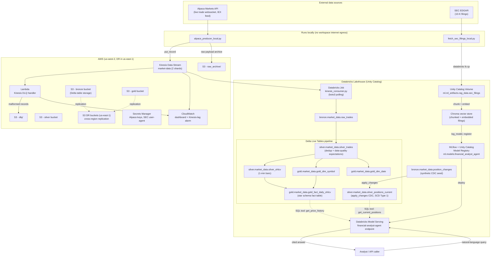

# Financial Intelligence Platform

A live market-data lakehouse and a retrieval-augmented financial analyst agent, built and deployed end to end on AWS + Databricks.

## Purpose

This project exists to demonstrate what it actually takes to **productionize an ML/RAG system on a real cloud data platform** — not a notebook demo, but a working pipeline with live external data, a medallion lakehouse, change-data-capture, a registered and served LLM agent, monitoring, and disaster recovery, all wired together by hand.

It streams real trades from the [Alpaca](https://alpaca.markets/) Markets API through Amazon Kinesis into a Databricks lakehouse (Bronze → Silver → Gold), and separately builds a retrieval-augmented **financial analyst agent** over real SEC 10-K filings, registers it in the MLflow/Unity Catalog model registry, and serves it as a live Databricks Model Serving endpoint that can answer questions using filing text, historical prices, and current portfolio positions in one response.

Everything here — the infrastructure, the pipeline, the agent, and the deployment tooling — was designed, built, and debugged by **[victorkamya](https://github.com/victorkamya)**.

## Architecture



**Reading it:** live trades and filing text both enter through scripts that run *outside* the Databricks workspace (see [Challenges](#challenges-faced), below, for why). From there, market data flows through Kinesis into a Bronze → Silver → Gold medallion lakehouse with a dead-letter path for bad records, while filing text is chunked, embedded, indexed, registered as an MLflow model, and served as a queryable agent that also reaches back into the Gold/Silver tables for live price and position data.

## Tech stack

| Layer | Technologies |
|---|---|
| **Cloud infrastructure (AWS)** | S3 (medallion storage + DR), Kinesis Data Streams, Lambda, IAM, Secrets Manager, CloudWatch (dashboards + alarms), cross-region S3 replication |
| **Data platform** | Databricks (serverless compute), Delta Lake, Delta Live Tables (DLT), Unity Catalog (catalogs, schemas, volumes), Databricks SQL Warehouses, Databricks Asset Bundles |
| **ML / RAG** | MLflow (tracking + Unity Catalog model registry), Databricks Model Serving, LangChain / LangGraph agents, Chroma vector store, Databricks-hosted embedding (`bge-large-en`) and chat (Llama 3.1 8B Instruct) endpoints |
| **Languages** | Python 3.12, SQL, PowerShell |
| **Key Python libraries** | `boto3` / `botocore`, `databricks-sdk`, `python-dotenv`, `pyspark`, `dlt`, `mlflow`, `langchain`, `langchain-community`, `langchain-text-splitters`, `databricks-langchain`, `chromadb`, `pandas`, `alpaca-py`, `requests`, `beautifulsoup4`, `lxml` |
| **External APIs / data** | Alpaca Markets (live trade websocket), SEC EDGAR (10-K filings) |
| **Tooling** | VS Code, Databricks CLI, AWS CLI, Git |

## How it works, stage by stage

**Stage 1 — Ingestion.** A local Python script authenticates to Alpaca's live trade websocket for a watchlist of symbols, pushes each trade onto a Kinesis stream, and archives the raw payload to S3. A Databricks job polls that stream via `boto3` and appends validated micro-batches into a Bronze Delta table. A Lambda function, wired to the same stream through a Kinesis event-source mapping, catches malformed records and routes them to an S3 dead-letter prefix instead of letting them break downstream processing.

**Stage 2 — Silver & Gold.** A single Delta Live Tables pipeline publishes across two catalogs: Silver applies deduplication and data-quality expectations to raw trades, aggregates them into one-minute OHLCV bars, and runs a CDC `apply_changes` flow (SCD Type 1 upsert/delete) to maintain current account positions. Gold builds a small star schema — symbol and date dimensions plus a daily OHLCV fact table with computed daily returns — ready for analytics or the agent to query.

**Stage 3 — RAG agent.** Real 10-K filings for AAPL, MSFT, and NVDA are fetched from SEC EDGAR, chunked, embedded via a Databricks-hosted embedding endpoint, and indexed into a Chroma vector store. That store, plus a LangGraph agent with tools for filing search, price history, and current positions, is packaged as an MLflow `pyfunc` model, registered to the Unity Catalog model registry, and deployed behind a Databricks Model Serving endpoint — so one query can return an answer that cites SEC filing text *and* live pipeline data together.

**Stage 4 — Monitoring & validation.** A CloudWatch dashboard tracks Kinesis streaming lag, incoming record rate, and Lambda error counts, backed by an alarm on iterator age. Since there's no automated test suite, an end-to-end validation script (`ml-pipeline/scripts/validate_pipeline.py`) stands in for one: it checks table row counts and lineage across all three layers, DLT data-quality expectation results, that the serving endpoint answers a real query, and that a deliberately-malformed Kinesis record actually gets routed to the dead-letter prefix.

## Challenges faced

Building this surfaced a handful of real, non-obvious problems — most of them only visible once actual traffic and actual deployment (not local testing) were in the loop:

1. **Databricks serverless compute in this workspace has no general internet DNS resolution.** Both the Alpaca websocket producer and the SEC EDGAR fetcher were originally written as Databricks notebooks, and both failed silently — `alpaca-py`'s websocket client retries connection failures instead of raising, so the job ran "successfully" for its entire timeout window without ever connecting, leaving the Bronze table empty with no error to chase. Fix: both now run as local scripts outside the workspace, writing/pushing their results in (Kinesis, S3, Unity Catalog Volumes).
2. **Terraform's single-dependency-graph failure mode was a poor fit for iterative cloud setup.** An early Terraform module (kept in its own separate repo) provisioned everything as one apply — a failure partway through blocked resources that had nothing to do with the actual problem. It was replaced with an idempotent, step-by-step Python deployment script that can be re-run safely and resumes cleanly from wherever it left off.
3. **Chroma can't build its index directly on a Unity Catalog Volume.** Chroma's SQLite backend needs POSIX file locking that a Volume's FUSE mount doesn't provide (`disk I/O error`). The vector store is instead built on local ephemeral disk during the job and persisted through MLflow's own artifact packaging, avoiding a separate Volume copy step entirely.
4. **Model Serving containers have no ambient Spark session or Databricks auth.** A `WorkspaceClient()` inside a serving container fails with a bare-credentials error unless it's told how to authenticate. The agent's SQL tools moved to the Statement Execution API, and the serving endpoint is configured to inject `DATABRICKS_HOST`/`DATABRICKS_TOKEN` from a secret scope as environment variables.
5. **LangChain's agent APIs moved out from under the project mid-build.** `AgentExecutor`, `create_openai_tools_agent`, and `Retriever.get_relevant_documents()` were all deprecated in favor of `create_agent` (LangGraph-based) and the unified `.invoke()` interface — required a real migration, not just a version bump.
6. **A cross-account IAM trust policy design error was caught before it shipped.** The original Unity Catalog storage-credential IAM role used `"Service": "databricks.amazonaws.com"` as its trust principal — Databricks isn't an AWS-owned service, so this would never have worked. Cross-account role assumption has to go through Databricks' own AWS account instead.
7. **Freshly-created IAM roles aren't immediately usable.** The first attempt at wiring up S3 cross-region replication failed transiently because AWS hadn't finished propagating a role that had just been created. The deploy script now retries with backoff instead of failing hard on the first attempt.
8. **Metastore admin isn't workspace admin.** The service principal running the deployment script has metastore-admin rights (enough to create catalogs and schemas) but not workspace-admin — which the SCIM Groups API specifically requires. The two analyst/engineer groups had to be deferred rather than fully automated.

## Trade-offs, pivots, and lessons learned

- **Terraform → imperative Python.** Declarative infrastructure is the "correct" long-term answer, but for a fast-moving solo build where each resource needed independent verification, a step-by-step script with its own resumability was more productive than debugging one large dependency graph. The cost is losing Terraform's drift detection and plan/apply review — a real trade-off, not a free win.
- **Chroma instead of Databricks Vector Search.** Chroma was the pragmatic choice given the local-disk-build constraint above; Databricks Vector Search is the more "production-native" answer for a fully managed, Unity-Catalog-integrated index, and is the more likely target if this were rebuilt for a real deployment.
- **Synthetic data for the CDC path.** The Alpaca paper trading account has no real position history to drive a change-data-capture feed, so `silver_positions_current` is fed from a small, deliberately-varied synthetic seed (partial trims, buy-and-hold, close-then-reopen) — enough to exercise the `apply_changes` upsert/delete pattern honestly, without pretending it's real trading history.
- **Unity Catalog storage integration was left incomplete, on purpose, rather than rushed.** Catalogs and schemas currently use the metastore's Default Storage rather than being backed by the dedicated S3 medallion buckets — wiring that up correctly required storage-credential objects that weren't worth rushing to get right, so it's tracked as a known gap instead of silently left broken.
- **Waiting on live data instead of backfilling history was the wrong call, in hindsight.** Historical market data access from Alpaca (and most vendors) costs money, so the project relied on waiting for live trades to accumulate during market hours instead. That kept costs at zero but made iteration slow and dependent on when the market happened to be open — a lesson that shapes the first item in Future Work.

## Future work

- **Backfill historical market data** instead of relying solely on live-data accumulation, to make iteration and testing independent of market hours and no longer bottlenecked by cost-avoidance.
- **Wire up real Unity Catalog storage credentials and external locations** so the medallion catalogs are actually backed by their dedicated S3 buckets, not Default Storage.
- **Move from Chroma to Databricks Vector Search** for a fully managed, Unity-Catalog-native vector index.
- **Add CI/CD and an automated test suite.** Everything currently runs manually from a local terminal, verified by a hand-run validation script rather than pytest.
- **Finish the identity/access layer** — get workspace-admin (or an equivalent path) to complete SCIM group creation and the ABAC-style grants that were deferred.

## Repository layout

```
financial-intelligence-platform/
├── infra-deploy/            # AWS + Databricks provisioning (Python, idempotent, step-by-step)
│   ├── deploy.py
│   ├── requirements.txt
│   └── docs/                # deployment plan + a verification checklist with known gaps
├── ml-pipeline/
│   ├── notebooks/           # DLT pipeline, Kinesis consumer, RAG agent build, CDC seed data
│   └── scripts/             # local-only scripts: Alpaca producer, SEC EDGAR fetch, validation
├── databricks.yml           # Databricks Asset Bundle root config
└── resources/               # Asset Bundle job / pipeline / serving-endpoint definitions
```

## Running it

This is a portfolio build, not a one-command installer — reproducing it requires your own AWS account, Databricks workspace, and Alpaca API keys. Roughly, in order:

1. Provide AWS credentials and Databricks workspace credentials (`<workspace-id>.cloud.databricks.com`, a service principal client ID/secret, your metastore ID) plus Alpaca API keys as environment variables — never committed, loaded via a local, gitignored env file.
2. Run `infra-deploy/deploy.py` to provision the S3 buckets, Kinesis stream, IAM roles, DR replication, CloudWatch resources, Secrets Manager secrets, and Unity Catalog catalogs/schemas.
3. Run `databricks bundle deploy` to stand up the Kinesis consumer job, the DLT pipeline, the RAG agent build job, and the Model Serving endpoint defined under `resources/`.
4. Run the local `alpaca_producer_local.py` and `fetch_sec_filings_local.py` scripts to start feeding in live trades and filing text.
5. Run `ml-pipeline/scripts/validate_pipeline.py` to check the whole system end to end.

---

Built by **victorkamya**.
